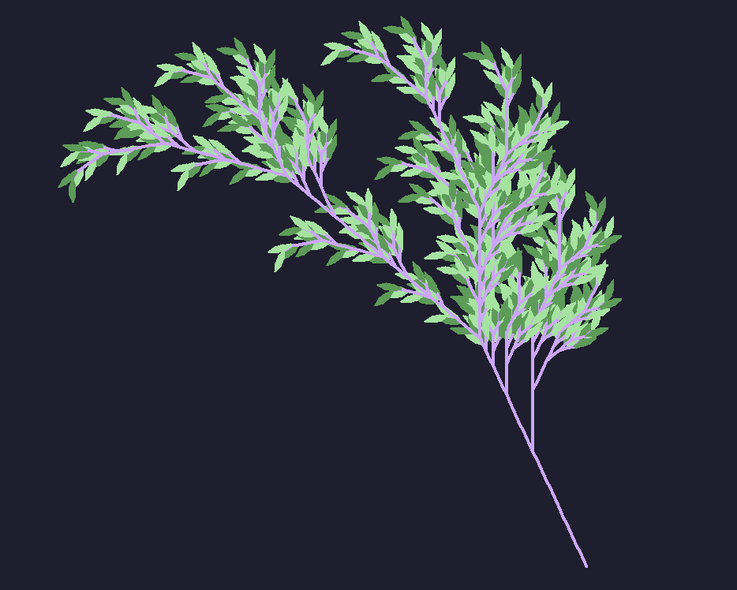

# L-System Fractal Generator

Gerador de fractais usando L-Systems (Lindenmayer Systems) escrito em Elixir com visualização em Python/Turtle.



## Sobre

L-Systems são sistemas de reescrita paralela desenvolvidos por Aristid Lindenmayer em 1968 para modelar o crescimento de plantas. Este projeto implementa tanto sistemas determinísticos quanto estocásticos, permitindo a geração de fractais complexos como árvores, flores e curvas matemáticas.

## Funcionalidades

- **Sistemas Determinísticos**: Regras fixas que sempre produzem o mesmo resultado
- **Sistemas Estocásticos**: Regras probabilísticas para resultados variados
- **Visualização**: Geração automática de código Python/Turtle para renderização
- **Configuração Flexível**: Arquivos `.cfg` para fácil customização
- **Menu Interativo**: Interface simples para carregar e executar configurações

## Alfabeto de Comandos

| Símbolo | Ação                             |
| ------- | -------------------------------- |
| `F`     | Desenhar para frente             |
| `f`     | Mover para frente (sem desenhar) |
| `L`     | Desenhar uma folha               |
| `[`     | Salvar posição e ângulo          |
| `]`     | Restaurar posição e ângulo       |
| `*`     | Mudar cor                        |
| `+`     | Virar à direita                  |
| `-`     | Virar à esquerda                 |
| `X`     | Não faz nada (usado no axioma)   |

## Como Usar

### Pré-requisitos

- Elixir 1.17+
- Python 3.x com turtle

### Executar

```bash
mix run run.exs
```

### Menu

```
=== L-System Generator ===
1 - Load setup.cfg
2 - Load custom file
3 - Show alphabet and examples
4 - Exit
```

## Formato do Arquivo de Configuração

Crie um arquivo `.cfg` com o seguinte formato:

### Sistema Determinístico

```
type=deterministic
axiom=X
rules=X=F+[[X]-X]-F[-FX]+X;F=FF
iterations=4
angle=25
length=10
```

### Sistema Estocástico

```
type=stochastic
axiom=X
rules=X=F-[[X]+X]+F[+FX]-X,0.6;X=F+[[X]-X]-F[-FX]+X,0.4;F=FF,1.0
iterations=4
angle=25
length=10
```

## Estrutura do Projeto

```
lib/
├── sys.ex          # Implementação dos L-Systems
├── py.ex           # Geração de código Python
├── configfile.ex   # Leitura de arquivos de configuração
└── menu.ex         # Interface do menu
```

## Módulos

### Sys
Implementa a lógica dos L-Systems:
- `l_system/2` - Aplica regras determinísticas
- `l_system_stochastic/2` - Aplica regras probabilísticas
- `l_system_iter/4` - Executa N iterações do sistema
- `execute_system/1` - Processa configuração e gera fractal

### Py
Gera código Python/Turtle para visualização:
- `generate_codestring/3` - Converte string L-System em código Python
- `save_file/4` - Salva código Python em arquivo
- `generate_and_run_fractal/4` - Gera, executa e limpa arquivo Python

### Configfile
Gerencia arquivos de configuração:
- `read/0` e `read/1` - Lê arquivo .cfg e retorna mapa de configuração
- `save/1` - Salva configuração em arquivo
- `decode_rules/2` - Converte regras de string para mapa

### Menu
Interface interativa do usuário:
- `show_menu/0` - Exibe menu principal e processa opções
- Opções: carregar setup.cfg, arquivo customizado, mostrar alfabeto


